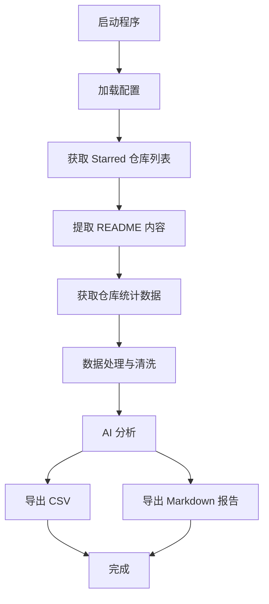

# 架构设计文档

## 📋 概述

GitHub Star Tracker 采用**模块化分层架构**，遵循**单一职责原则**和**依赖倒置原则**。整个系统被划分为多个独立的模块，每个模块负责特定的功能领域，模块间通过明确的接口进行交互。

## 🏗️ 架构图

```
┌─────────────────────────────────────────────────────────────────┐
│                          主程序 (main.py)                          │
│                        Orchestrator 模式                         │
└────────────────────┬──────────────────────────────────────────────┘
                     │
        ┌────────────┼────────────┐
        │            │            │
        ▼            ▼            ▼
┌─────────────┐ ┌─────────────┐ ┌─────────────┐
│   Config    │ │  Fetchers   │ │ Processors  │
│   配置模块    │ │   数据获取    │ │   数据处理    │
└─────────────┘ └─────────────┘ └─────────────┘
        │            │            │
        └────────────┼────────────┘
                     ▼
        ┌─────────────────────────────────┐
        │         Analyzers                │
        │           分析模块                │
        └────────────┬──────────────────────┘
                     │
        ┌────────────┼────────────┐
        ▼            ▼            ▼
┌─────────────┐ ┌─────────────┐ ┌─────────────┐
│   Output    │ │   Utils     │ │   Models    │
│   输出模块    │ │   工具模块    │ │   数据模型    │
└─────────────┘ └─────────────┘ └─────────────┘
```

## 🔄 数据流



## 📦 详细模块说明

### 1. 配置层 (src/config/)

**职责**: 统一管理应用程序配置

**核心组件**:
- `settings.py` - 应用配置管理类
- `github_api.py` - GitHub API 配置

**设计要点**:
- 使用 `@dataclass` 定义配置类
- 提供类型提示和默认值
- 支持从环境变量加载配置
- 配置验证确保完整性

**示例**:
```python
settings = Settings.from_env()
headers = settings.github_headers
```

### 2. 数据获取层 (src/fetchers/)

**职责**: 从外部源（GitHub API）获取数据

**核心组件**:
- `base.py` - 基础Fetcher类，定义通用接口
- `starred_repos.py` - 获取用户starred仓库列表
- `repo_stats.py` - 获取仓库统计数据（提交数、最新提交等）
- `readme_extractor.py` - 提取并总结README内容

**设计要点**:
- 继承 `BaseFetcher` 基类实现一致性
- 每个fetcher专注于一种数据类型
- 使用泛型提高类型安全性
- 错误处理和重试机制

**示例**:
```python
repo_fetcher = StarredRepoFetcher(settings)
repos = repo_fetcher.fetch()

stats_fetcher = RepoStatsFetcher(settings)
commits = stats_fetcher.fetch_commit_activity("owner/repo")
```

### 3. 数据处理层 (src/processors/)

**职责**: 对原始数据进行清洗、转换和丰富化

**核心组件**:
- `data_processor.py` - 主数据处理器
- `language_analyzer.py` - 编程语言分析
- `description_enricher.py` - 项目描述丰富化

**设计要点**:
- 流水线式处理数据
- 可插拔的处理步骤
- 数据验证和清洗
- 性能优化（仅对活跃项目进行深度分析）

**示例**:
```python
processor = DataProcessor(settings)
processed_data = processor.process_repositories(
    repos, readme_extractor, stats_fetcher
)
```

### 4. 分析层 (src/analyzers/)

**职责**: 使用AI对数据进行深度分析

**核心组件**:
- `ai_analyzer.py` - AI分析器（LangChain）
- `report_generator.py` - 报告生成器

**设计要点**:
- 使用LangChain的LCEL（LangChain Expression Language）
- 链式调用：`PromptTemplate | ChatOpenAI | StrOutputParser`
- 可配置的分析模板
- 错误处理和降级策略

**示例**:
```python
analyzer = AIAnalyzer(settings)
report = analyzer.analyze(df)
```

### 5. 输出层 (src/output/)

**职责**: 将数据导出为不同格式

**核心组件**:
- `csv_exporter.py` - CSV导出器
- `markdown_exporter.py` - Markdown导出器
- `file_manager.py` - 文件管理

**设计要点**:
- 按文件类型分类输出目录
- 时间戳命名避免冲突
- 支持自定义输出格式
- 文件编码统一为UTF-8

**示例**:
```python
csv_exporter = CSVExporter()
csv_exporter.export(data, timestamp)

markdown_exporter = MarkdownExporter()
markdown_exporter.export(report, timestamp)
```

### 6. 工具层 (src/utils/)

**职责**: 提供通用工具函数

**核心组件**:
- `logger.py` - 日志记录
- `validators.py` - 数据验证
- `helpers.py` - 辅助函数

### 7. 模型层 (src/models/)

**职责**: 定义数据模型

**核心组件**:
- `repository.py` - Repository数据模型
- `analysis_result.py` - 分析结果模型

**设计要点**:
- 使用 `@dataclass` 定义
- 提供序列化/反序列化方法
- 数据验证和类型检查

## 🔌 模块依赖关系

```
main.py
  ├── config (无依赖)
  ├── fetchers (依赖 config)
  ├── processors (依赖 config, fetchers, models)
  ├── analyzers (依赖 config, models)
  ├── output (无依赖)
  ├── utils (无依赖)
  └── models (无依赖)
```

**关键原则**:
- 高层模块不依赖低层模块，都依赖抽象
- 抽象不依赖细节，细节依赖抽象
- 数据流向：Fetchers → Processors → Analyzers → Output

## 🎯 设计模式应用

### 1. **工厂模式 (Factory Pattern)**
在配置加载中使用，从环境变量创建配置对象。

### 2. **策略模式 (Strategy Pattern)**
不同的处理器（数据处理器、分析器）可以互换。

### 3. **模板方法模式 (Template Method Pattern)**
`BaseFetcher` 定义算法骨架，子类实现具体步骤。

### 4. **单一职责原则 (SRP)**
每个模块只有一个改变的理由。

### 5. **开放封闭原则 (OCP)**
对扩展开放，对修改封闭。新功能通过添加新模块实现。

## 🔒 错误处理策略

### 1. **分层错误处理**
- Fetcher层：网络错误、API限制
- Processor层：数据验证错误
- Analyzer层：AI服务错误
- Output层：文件写入错误

### 2. **优雅降级**
- API失败：跳过该项目，继续处理其他项目
- LLM失败：使用简单提取方法
- 文件写入失败：记录错误但不影响其他输出

### 3. **错误日志**
- 所有错误记录到日志文件
- 用户友好的错误信息
- 完整堆栈跟踪用于调试

## 🚀 性能优化

### 1. **API调用优化**
- 限制请求速率（0.2s延迟）
- 跳过非活跃项目的深度分析
- 缓存机制（可选）

### 2. **并发处理**
- 可以使用 `concurrent.futures` 并行获取统计数据
- 异步IO（asyncio）优化网络请求

### 3. **内存优化**
- 流式处理大量数据
- 及时释放不需要的对象

### 4. **懒加载**
- 按需加载模块
- 延迟初始化重型组件

## 🧪 测试策略

### 1. **单元测试**
- 每个模块独立测试
- Mock外部依赖（GitHub API、LLM）
- 覆盖率目标：>80%

### 2. **集成测试**
- 测试模块间交互
- 端到端测试完整流程

### 3. **测试工具**
- pytest 作为测试框架
- pytest-mock 用于Mock
- pytest-cov 用于覆盖率

## 📈 可扩展性

### 1. **添加新的数据源**
实现新的Fetcher类，无需修改现有代码。

### 2. **添加新的分析算法**
实现新的Analyzer类或Processor类。

### 3. **添加新的输出格式**
实现新的Exporter类。

### 4. **插件机制**
使用 `entry_points` 支持插件式扩展。

## 🔧 配置管理

### 1. **环境变量**
- 开发环境：`.env` 文件
- 生产环境：系统环境变量或密钥管理服务

### 2. **配置文件**
- 支持 `pyproject.toml` 配置
- 支持 `config.yaml` 配置（可选）

### 3. **配置优先级**
命令行参数 > 环境变量 > 配置文件 > 默认值

## 📚 依赖管理

### 核心依赖
- `requests` - HTTP请求
- `pandas` - 数据处理
- `langchain` - AI分析
- `python-dotenv` - 环境变量

### 开发依赖
- `pytest` - 测试框架
- `black` - 代码格式化
- `flake8` - 代码检查
- `mypy` - 类型检查

## 🎓 最佳实践

1. **编写文档字符串** - 所有公共API必须有文档
2. **类型提示** - 所有函数应有类型提示
3. **常量定义** - 魔法数字使用常量
4. **异常处理** - 具体异常具体处理
5. **日志记录** - 关键操作记录日志
6. **代码复用** - 避免重复代码
7. **单一职责** - 每个类/函数只做一件事
8. **保持简单** - KISS原则

## 📝 版本演进

### v1.0 (当前版本)
- 单文件架构
- 基础功能完整

### v2.0 (重构版本)
- 模块化架构
- 增强可测试性
- 添加类型提示
- 完善文档

### v3.0 (未来规划)
- 异步IO支持
- 插件系统
- Web UI
- 更多输出格式

---

**维护者**: Claude Code
**文档版本**: v1.0
**最后更新**: 2025-12-01
